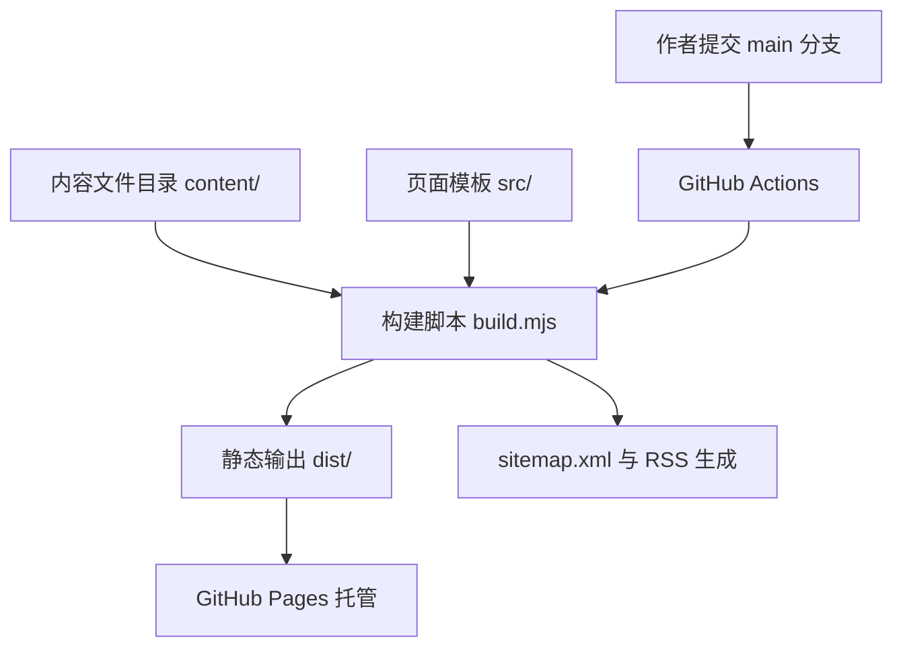

# 个人博客与作品展示站

Feature Name: personal-blog-portfolio
Updated: 2026-08-05

## Description

`xh2580.github.io` 是一个部署在 GitHub Pages 上的个人博客与作品展示站点，采用纯静态 HTML/CSS/JS 技术栈，无需后端服务。站点提供首页、博客文章列表与详情、作品展示、关于我四个核心模块，内容以 Markdown 与结构化 JSON 文件方式管理。

站点采用构建时静态生成的架构：作者维护内容文件，构建脚本读取内容并生成静态 HTML 页面，通过 GitHub Actions 自动部署到 GitHub Pages。此架构兼顾 SEO（服务端渲染完成的 HTML）、部署成本（静态托管免费）与内容维护便利性（纯文件）。

## Architecture



构建流程：作者在 `content/` 目录维护 Markdown 文章与 JSON 元数据，`build.mjs` 脚本读取内容文件，将 Markdown 渲染为 HTML，并套用 `src/` 中的页面模板生成静态页面到 `dist/`。GitHub Actions 监听 `main` 分支推送，执行构建后发布 `dist/` 到 GitHub Pages。`dist/` 目录是唯一部署产物。

## Components and Interfaces

### 1. 构建脚本 `build.mjs`

Node.js 编写的零依赖或最小依赖构建脚本，负责：
- 遍历 `content/posts/*.md` 解析 Markdown 元数据（frontmatter）与正文。
- 遍历 `content/projects.json` 读取作品数据。
- 读取 `content/about.md` 与 `content/home.md` 生成对应页面。
- 依据模板渲染各页面 HTML 到 `dist/`。
- 生成 `dist/index.html`（首页）、`dist/blog/index.html`（列表）、`dist/blog/{slug}/index.html`（详情）、`dist/projects/index.html`（作品）、`dist/about/index.html`（关于）。
- 生成 `dist/sitemap.xml` 与 `dist/feed.xml`。

**接口：**
- 输入：`content/` 内容目录、`src/` 模板目录。
- 输出：`dist/` 静态站点目录。
- 命令行入口：`node build.mjs`。

### 2. 内容目录 `content/`

结构化内容源，作者维护：
- `content/posts/*.md`：博客文章，frontmatter 含 `title`、`date`、`slug`、`tags`、`summary`，正文为 Markdown。
- `content/projects.json`：作品数组，每项含 `name`、`description`、`tags`、`link`、`thumbnail`。
- `content/home.md`：首页作者简介。
- `content/about.md`：关于我页面内容。

### 3. 页面模板 `src/`

HTML 模板文件，含导航栏、页脚、模块布局与样式占位：
- `src/templates/base.html`：公共布局（导航栏、页脚、内容插槽）。
- `src/templates/post.html`：文章详情页模板。
- `src/templates/list.html`：文章列表页模板。
- `src/templates/projects.html`：作品展示模板。
- `src/static/style.css` 与 `src/static/main.js`：全局样式与少量交互脚本。

### 4. GitHub Actions 工作流 `.github/workflows/deploy.yml`

- 触发：推送 `main` 分支。
- 步骤：检出代码 → 安装 Node 运行环境 → 运行 `build.mjs` → 部署 `dist/` 到 GitHub Pages。

### 5. 运行时前端脚本 `main.js`

- 导航栏当前页高亮。
- 键盘焦点管理（`Tab` 遍历可见性）。
- 作品外链新标签页打开（含 `rel="noopener noreferrer"`）。

## Data Models

### 博客文章（Post）

```
{
  title: string,        // 文章标题
  date: string,         // 发布日期，格式 YYYY-MM-DD
  slug: string,         // URL 标识，默认取文件名
  tags: string[],       // 标签列表，可为空
  summary: string,      // 列表页展示的摘要
  contentHtml: string,  // 构建时由 Markdown 渲染的 HTML
  url: string           // /blog/{slug}/
}
```

### 作品（Project）

```
{
  name: string,            // 作品名称
  description: string,     // 作品描述
  tags: string[],          // 技术标签
  link: string,            // 外部链接，可选
  thumbnail: string        // 封面图路径，可选
}
```

### 站点配置 `content/site.json`

```
{
  title: string,          // 站点标题
  author: string,         // 作者名
  email: string,          // 联系方式，可选
  social: {               // 社交链接映射
    github: string,
    linkedin: string
  }
}
```

## Correctness Properties

- **排序不变量**：文章列表始终按 `date` 降序排列；相同日期的文章按文件名字母序升序排列，保证稳定排序。
- **URL 唯一性**：任意两篇文章的 `slug` 不得重复；构建脚本检测到重复 slug 时以非零退出码失败。
- **引用完整性**：作品数据引用的 `link` 与 `thumbnail` 字段均为可选项；`thumbnail` 路径存在性在构建时校验，缺失时使用占位图。
- **站点完整性**：每次构建生成的 `dist/` 必须包含首页、博客列表、作品页、关于页四个核心页面，缺失任一页面构建即失败。
- **日期有效性**：文章 `date` 必须符合 `YYYY-MM-DD` 格式，非法日期导致构建失败。

## Error Handling

| 场景 | 处理策略 |
|------|---------|
| Markdown frontmatter 缺少必填字段（`title`、`date`） | 构建脚本输出警告并跳过该文章，构建继续 |
| 重复的 slug | 构建失败并输出冲突文章列表 |
| `content/` 目录为空 | 生成各模块空状态页面，页面显示友好提示 |
| 页面访问不存在的内容路径 | 生成并托管 404 页面，提供返回博客列表入口 |
| 构建依赖安装失败 | GitHub Actions 任务失败并输出日志，作者可查看失败原因 |
| 外部链接失效 | 属内容层问题，构建不拦截；作品卡片正常渲染文本，作者自行维护 |

## Test Strategy

- **构建冒烟测试**：执行 `build.mjs` 后校验 `dist/` 下四个核心页面均存在且含导航栏。
- **排序测试**：以多篇不同日期文章为输入，断言输出列表顺序为日期降序。
- **Markdown 渲染测试**：校验包含标题、代码块、引用、列表的 Markdown 被正确渲染为对应 HTML 标签。
- **slug 冲突测试**：构造两个同名 slug 文件，断言构建以失败状态退出。
- **响应式测试**：以 375px、768px、1200px 三种视口宽度打开页面，断言无横向滚动条。
- **可访问性检查**：对生成页面运行基础可访问性检查，断言导航栏可用键盘操作、图片含 alt 文本。
- **部署验证**：推送 main 分支后检查 GitHub Actions 运行状态与 Pages 部署链接 `https://xh2580.github.io` 可访问。

## References

- GitHub Pages 部署文档：站点部署机制（GitHub Pages）[^1]
- GitHub Actions 工作流语法参考：构建自动化触发方式[^2]
- Markdown 语法基础：正文渲染规范依据[^3]

[^1]: (Website) - [GitHub Pages 文档](https://docs.github.com/pages)
[^2]: (Website) - [GitHub Actions 文档](https://docs.github.com/actions)
[^3]: (Website) - [Markdown 语法规范](https://www.markdownguide.org/)
